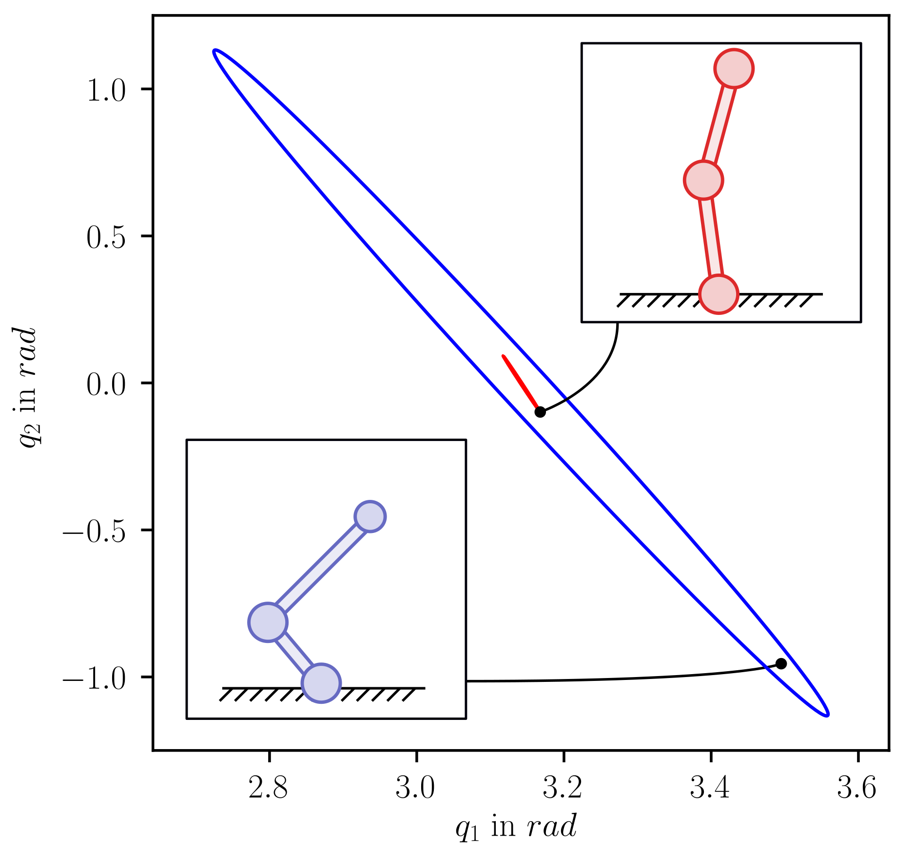
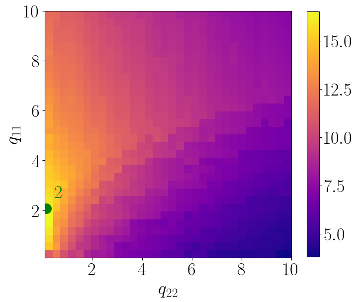
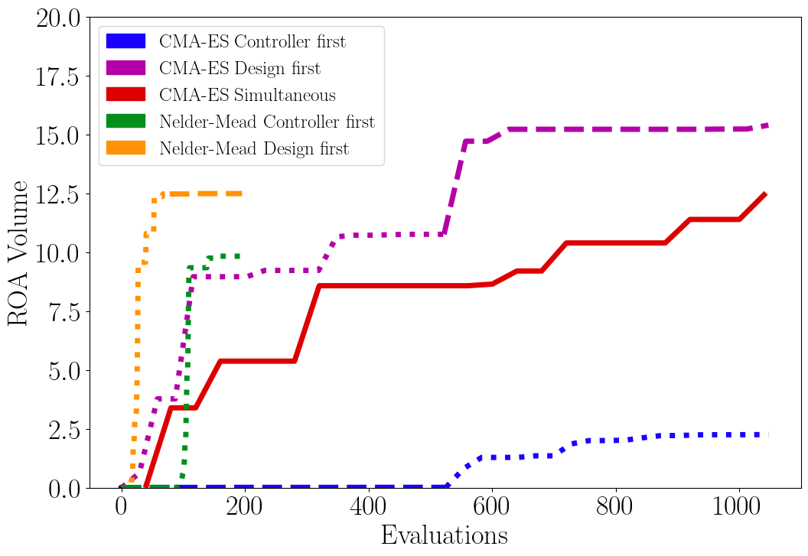

# Co-optimization of Acrobot Design and Controller for Increased Certifiable Stability

This repository contains the code, data and plots of the paper [Co-optimization of Acrobot Design and Controller for Increased Certifiable Stability](https://dfki-ric-underactuated-lab.github.io/design_controller_cooptimization_acrobot/). The paper was accepted at the [IROS 2022 Conference](https://iros2022.org/). A preprint is available on [Researchgate](https://www.researchgate.net/publication/362129400_Co-optimization_of_Acrobot_Design_and_Controller_for_Increased_Certifiable_Stability).

### Background
Recent research on control of walking robots focuses on the study of undercatuated systems, where taking into account the systems passive dynamics is required to achieve truly dynamic and energy efficient behaviours. Many approaches to controlling such systems incorporate offline trajectory optimization and stabilization using online optimal control. Furthermore, design optimization can be carried out to optimize the physical parameters such as masses and link lengths. In this work we propose a novel a novel approach to co-optimzation of design and control parameters. The goal of this optimization is maximizing the Region of attraction (ROA) of a desired state that is associated to a fixed point of the closed loop dynamics. For a first case study, we consider a scenario that involves stabilizing an acrobot at its unstable upright posture using infinite horizon LQR control.

### Content
The scripts for generating the data and plots can be found in the [scripts](scripts) folder. The data and plots published in the paper are stored at [results/paper](results/paper). The source code for the acrobot dynamics, ROA computation, optimization and plotting is in the [src/coop](src/coop) folder.

### Installation
The requirements for the code can be installed with

    pip install -r requirements.txt

### Plots

### Citation
Maywald, Lasse & Wiebe, Felix & Kumar, Shivesh & Javadi, Mahdi & Kirchner, Frank. (2022). Co-optimization of Acrobot Design and Controller for Increased Certifiable Stability. 10.13140/RG.2.2.36436.07043.

  
  

