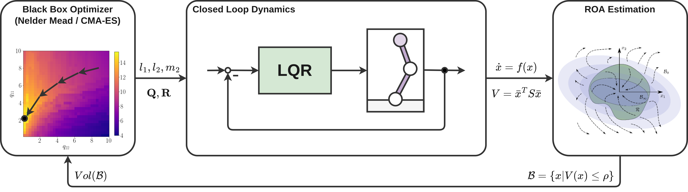
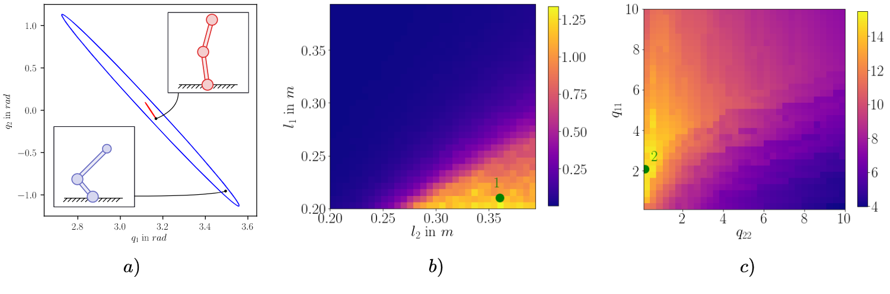

## Introduction
Recent research on control of walking robots focuses on the study of undercatuated systems, where taking into account the systems passive dynamics is required to achieve truly dynamic and energy efficient behaviours. 
Many approaches to controlling such systems incorporate offline trajectory optimization and stabilization using online optimal control.
Furthermore, design optimization can be carried out to optimize the physical parameters such as masses and link lengths.
In this work we propose a novel a novel approach to co-optimzation of design and control parameters.
The goal of this optimization is maximizing the Region of attraction (ROA) of a desired state that is associated to a fixed point of the closed loop dynamics.
For a first case study, we consider a scenario that involves stabilizing an acrobot at its unstable upright posture using infinite horizon LQR control.

{style="display: block; margin: auto; padding: 20px;" }

## Methodology
We employ two black box optimization algorithms, namely *CMA-ES* and *Nelder-Mead* to maximize the volume of the ROA, which is estimated using a probabilistic method based on najafi. 
For this, we consider a quadratic Lyapunov function that is constructed using the optimal cost-to-go obtained by solving the LQR problem for the linearized dynamics around the upright pose of the acrobot.
In order to reduce the dimensionality of the problem, we optimize over the physical design variables and the control variables separately.

{style="display: block; margin: auto; padding: 20px;" }

## Case Study
For the acrobot case study, we optimized over both link-lengths, a point mass at the end of the second link and the diagonal elements of the $\mathbf{Q}$ and $\mathbf{R}$ matrices. We intialized the optimization with $l_1=0.3m$, $l_2=0.2m$ and $m_2=0.63kg$ and identity matrices for $\mathbf{Q}$ and $\mathbf{R}$. 

{style="display: block; margin: auto; padding: 20px;" }

After multiple simulations using two different optimizers and different strategies, the parameters for the best performing design were found to be $l_1=0.2m$, $l_2=0.4m$, $m_2=0.22kg$, $q_{11}=2.08$, $q_{22}=0.15$, $q_{33}=0.99 = q_{44}=0.99$ and $r_{11}=0.62$. 
For these parameters the estimated ROA is significantly larger than for the initial ones as can be seen in the figure above that also shows the objective function in different projections of the state space.

## Citation

Maywald, Lasse & Wiebe, Felix & Kumar, Shivesh & Javadi, Mahdi & Kirchner, Frank. (2022). Co-optimization of Acrobot Design and Controller for Increased Certifiable Stability. 10.13140/RG.2.2.36436.07043.

```bibtex
@misc{maywald2022,
  author = {Maywald, Lasse and Wiebe, Felix and Kumar, Shivesh and Javadi, Mahdi and Kirchner, Frank},
  year = {2022},
  month = {07},
  pages = {},
  title = {Co-optimization of Acrobot Design and Controller for Increased Certifiable Stability},
  doi = {10.13140/RG.2.2.36436.07043}
}

```
